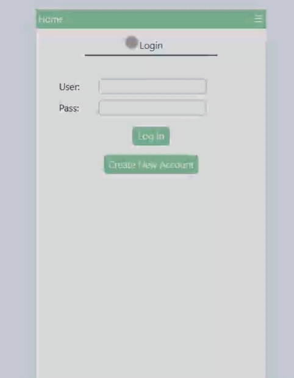
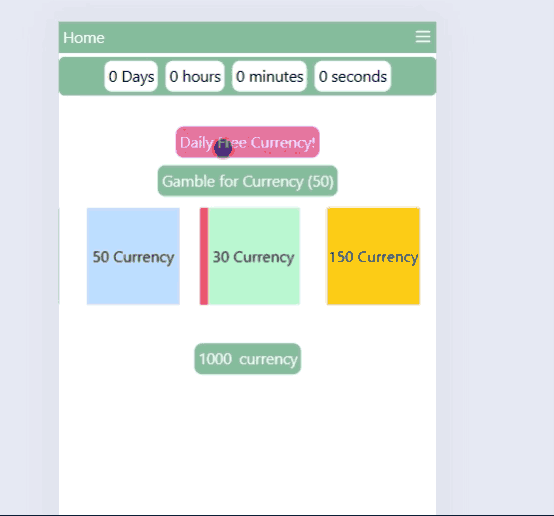
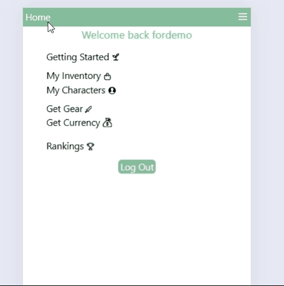
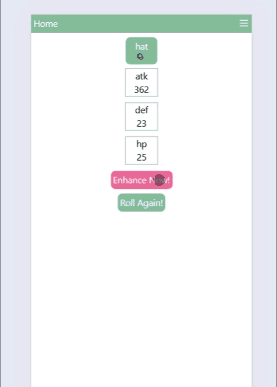
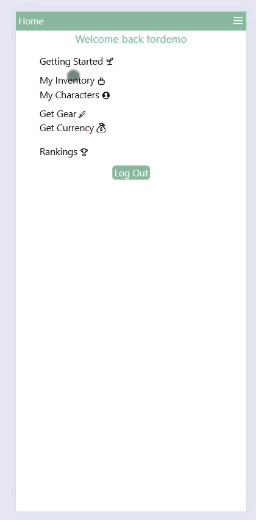
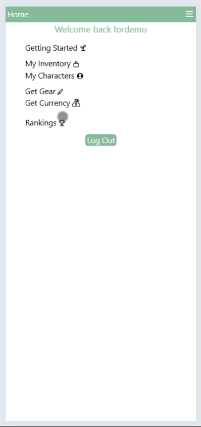
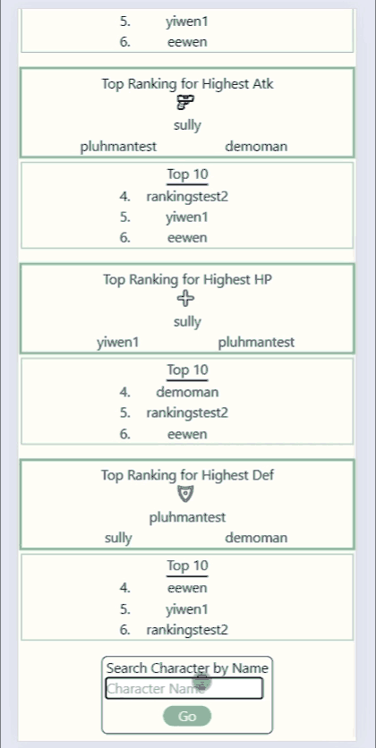

# 🎲 Gacha Gear Personal Project

`` https://gachagear.app/ ``

## 🌻 Goal
This is my first personal project after completing my bootcamp and working on a web-app for an NPO. I decided to do a mono repo approach, and
my goal was to get even more proficient with TypeScript, React, Express, Node, TailwindCSS, and postgreSQL. I want to display what I learned 
and supplement my fullstack capability, including aspects like DOCKER, useContext, JWTs, password encryption and salts, deployment on digital ocean, 
and GSAPS animations.

## 💬 Project Contents
For now, it is only styled for **MOBILE ONLY**. <br>
As someone that loves gacha games, I aimed to emulate the fun (and misery) of rolling in notable games like Genshin Impact, Epic Seven, and
Counter Strike. Users are able to sign up and start using the app. They can obtain gear, enhance the gear to get a random substat increase, equip
them on a character, and display the character in the rankings page. Not only that, but they are able to search other character names in a search
box and see the global rankings on multiple categories. Currency is also a feature that is used to upgrade items and open lootboxes which can yield
more currency and skins.

## Notable Features:
```
• User sign-up with password encryption
• User character sprite customizablity (WIP)
• JSON Web Tokens for authentication
• Backend route protection from jwt verification
• TailwindCSS & GSAPs animations
    - Especially when it comes to opening currency boxes and skins
• Rankings routing through db queries
• Randomly generated items and skins utilizing the model
• Weighted RNG
• Docker for consistent environment setup
```

## 💻 Teck stack:

👾 Front-End: <br>
```
• React-Vite
• Typescript
• TailwindCSS
• GSAPs
• Docker
```
🔧 Back-End: <br>
```
• ExpressJS
• Typescript
• Node
• PostgreSQL
• Prisma ORM
• Docker
```
## 🎥 Demo:

### Sign-Up and Login


### Rolling for Currency


### Getting Gear


### Enhancing Gear


### Creating & Equipping Gear on Character


### Viewing Rankings


### Searching Character


## 🚧 Challenges
Throughout this project, I encountered several challenges that helped me grow:

### 1. Docker Setup
This was my first time utilizing Docker, and getting started was a steep learning curve. Understanding key concepts like containers, volumes, and how to use commands such as docker compose build took time. Initially, making sure that both frontend and backend servers ran with the correct configs was tricky. However, with guidance from a fellow software engineer and extensive research, I grasped the basics and began to appreciate how powerful Docker is for consistent environment setup and collaboration. This experience has solidified my confidence in using Docker for future projects.

### 2. Deployment on DigitalOcean
Deploying on a platform I had never used before presented its own set of challenges. I learned the importance of understanding specific needs for production and ensuring that all environments are fully tested.

Additionally, setting up a personal domain for the first time required trial and error, as well as a lot of research. While I initially struggled with DNS configurations and server deployment, it paid off, and I successfully launched the app with my custom domain.

### 3. Frontend Design with Tailwind CSS and GSAPs
CSS has always been a weak spot for me, and getting the app to look and behave as intended took considerable effort. Learning to structure and customize styles with Tailwind CSS required repeated reference to the documentation and experimenting with class combinations. By pushing through this challenge, I became much more comfortable with frontend styling and responsive design.

### 4. Backend Data Manipulation
Implementing complex backend features, like the rankings endpoint, pushed me to improve my understanding of JavaScript methods. I had to carefully use functions like map, reduce, filter, and sort to ensure the data was processed efficiently and returned in the correct format. This ehanced my problem-solving skills and improved my ability to manipulate and query data effectively.

## ⭐ What I Learned

Overall, I gained a lot more proficiency in what I had known before, as well as develop even further on frontend and backend capabilites. 
<br><br>One Big
aspect I learned was docker. Setting up a dockerfile in each workspace (frontend and backend) and setting up a docker compose file made me 
realize how useful docker can be. With this setup, new contributors can have a much easier time setting up their environment, and onboarding can
be done a lot smoother. I even was able to have friends who have never used git/docker/javascript to be able to contribute a few lines of code
due to how docker works. I will definitely utilize it for all future projects I create.<br><br>
In terms of backend, I was able to learn and implement aspects that would make it more robust and secure. This was the first time I implemented JWTs
solo, and I see how powerful it is. There was no need to add anything new to the db, and it can seamlessly verify encrypted passowrd. Not only that, but I also gained more knowledge about Express in general, such as how you can add another function in between the endpoint and the controller that acts as a middle function (how i implemented protected routes). <br><br>
My postgreSQL handling has also improved using an ORM like prisma. I learned so much on how powerful it can be by running implementing extra functions to
get the desired result to the controller, especially when creating the rankings endpoint.<br><br>
As for the frontend, my comfort with dealing with states and hooks has improved significantly. My acknowledgement of what should be set as a state, what dependency arrays should be used, and implementation of useContext to spread data to all pages all assited me. CSS and tailwind has always been a struggle to me, but since beginning this project, I have grown to be confident in the subject.<br><br>
I currently have around 30 users, gained their feedback, and am constantly making adjustments to satisfty their opinions. I once again realize how important it is to implement CI/CD since deployment took a long time to figure out. But, I am proud that my project is successfully up and running on my personal domain that I bought. 

# 📁 Folder Structure

## /frontend
* contains all the following for the frontend
### public
* contains assets and svgs used throught various parts of the webapp
    * **/charactersprites** : contains all the assets utilized for default Character sprite
### src
* holds all pages, components, webapp itself, etc.
    * **/api**: holds all fetches for the user-end portion of the webapp
    * **/components**: contains folders for components used in various pages of the user-end
        * <ins>/CaseOpeningAnimation</ins>: components that holds the currency rolling
        * <ins>/SkinOpeningAnimation</ins>: components that holds skin opening function/animation
        * <ins>/createNewAccForm</ins>: components used in creating account
        * <ins>/EnhanceForm</ins>: components used in UpgradeItemPage to enhance an item
        * <ins>/Layout</ins>: components used to establish the navbar and everything below
        * <ins>/NavBar</ins>: the navbar component
        * <ins>/SearchRankings</ins>: search public character profile found in rankings page
        * <ins>/SwapEquipForm</ins>: components used in OneCharacterPage to equip gear
        * <ins>/Timer</ins>: components used CurrencyBox page to determine when free daily box is available
    * **/interfaces**: holds all types throughout user-end files
    * **/middleware**: contains the useContext hook to share userinfo to all parts of the webapp
    * **/pages**: contains all pages of user-end
    * **App.tsx**: has all routes needed to reach different parts of the web app
## /backend
* contains all of the following for the backend
### prisma
* holds files used for the ORM like the schema, seed data, and migrations.
### src
* contains all MVC files utilized in the backend, routes, and the server.ts file
* **/controller, /model**: model and controller for the backend
    * <ins>account</ins>: backend account functions
    * <ins>character</ins>: backend character functions
    * <ins>inventory</ins>: backend item management
    * <ins>item</ins>: backend item upgrading
    * <ins>skin</ins>: backend skin functions
* **/interfaces**: contains all types for typescript
* **/middleware**: contains the middleware function to verify the token in the header
* **routes.ts**: holds all endpoints available for the server
* **server.ts**: main express server file
